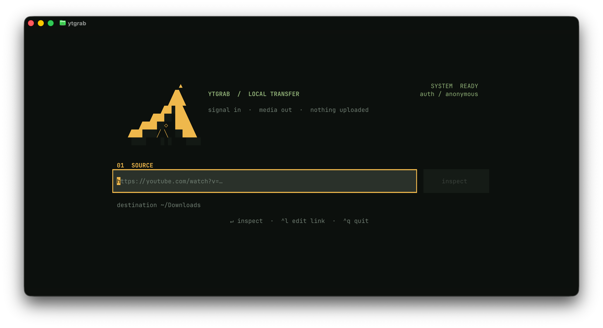

# YTGRAB

YTGRAB is a keyboard-friendly terminal interface for inspecting and downloading
YouTube videos with [`yt-dlp`](https://github.com/yt-dlp/yt-dlp). It keeps the
workflow focused: paste a link, choose a format, and save the result locally.



## Features

- Lists the resolutions actually available for a video.
- Downloads video with audio as MP4, or extracts audio as MP3.
- Shows progress, speed, remaining time, and post-processing status.
- Offers a compatible MP4 mode (H.264 up to 1080p, HEVC above 1080p).
- Can use an existing browser session when YouTube asks for authentication.
- Resumes partial downloads and supports immediate cancellation.
- Works with both keyboard and mouse in wide and narrow terminals.

## Requirements

- Python 3.11 or newer
- [FFmpeg](https://ffmpeg.org/) available in `PATH`
- A terminal with Unicode and true-color support

Install FFmpeg with your operating system's package manager:

```bash
# macOS with Homebrew
brew install ffmpeg

# Ubuntu / Debian
sudo apt install ffmpeg

# Windows with winget
winget install Gyan.FFmpeg
```

## Install

[`pipx`](https://pipx.pypa.io/) is recommended because it installs YTGRAB in an
isolated environment while making the `ytgrab` command available everywhere.

Download or clone this repository, open a terminal in its directory, and run:

```bash
pipx install .
ytgrab
```

If `pipx` is not installed yet, use the appropriate command:

```bash
# macOS
brew install pipx
pipx ensurepath

# Ubuntu / Debian
sudo apt install pipx
pipx ensurepath

# Windows
py -m pip install --user pipx
py -m pipx ensurepath
```

Restart the terminal after `ensurepath` if the `ytgrab` command is not found.

### Development install

```bash
python3 -m venv .venv
source .venv/bin/activate       # Windows: .venv\Scripts\activate
python -m pip install -e .
ytgrab
```

Run the smoke test with:

```bash
python tests/smoke_test.py
```

## Controls

| Key | Action |
| --- | --- |
| `Enter` | Inspect a link or confirm the selected format |
| `↑` / `↓` | Select a quality |
| `Ctrl+L` | Focus the URL field |
| `Ctrl+R` | Inspect the current URL |
| `Ctrl+X` | Cancel the active download |
| `Esc` | Return to the source screen |
| `Ctrl+Q` | Quit |

## Download modes

**Compatible MP4** prefers H.264/AAC streams and converts incompatible video
after download when required. It uses VideoToolbox on macOS and FFmpeg's
software encoders on Linux and Windows. H.264 is used up to 1080p and HEVC for
1440p and 4K.

**Best quality** preserves the original YouTube codecs, including AV1 and VP9.

## Privacy

YTGRAB has no analytics, accounts, telemetry, or remote backend of its own.
Video URLs are passed directly to YouTube through `yt-dlp`, and downloaded files
stay in the folder you choose.

When browser authentication is enabled, `yt-dlp` reads cookies from the selected
browser at runtime. YTGRAB does not copy cookies into the project or save them in
its settings. It stores only the selected browser name in the standard per-user
configuration directory:

- macOS: `~/Library/Application Support/ytgrab/settings.json`
- Linux: `${XDG_CONFIG_HOME:-~/.config}/ytgrab/settings.json`
- Windows: `%APPDATA%\ytgrab\settings.json`

## Troubleshooting

- **`ffmpeg` not found:** install FFmpeg and restart the terminal.
- **YouTube requests sign-in:** choose a browser where you are already signed
  in. Close the browser first if its cookie database is locked.
- **The command is not found after installation:** run `pipx ensurepath`, then
  restart the terminal.
- **A codec does not play:** use **Compatible MP4** instead of **Best quality**.

## Legal note

Download only media you own or are permitted to download, and follow the terms
that apply to the source service and your jurisdiction. This project is not
affiliated with or endorsed by YouTube or Google.

## License

Released under the [MIT License](LICENSE).
